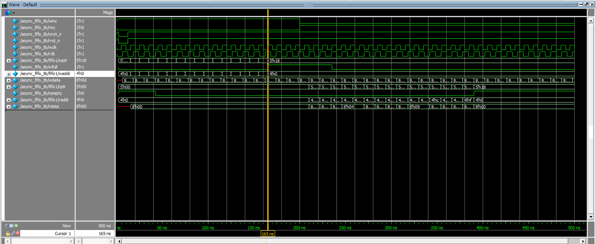

# 对代码的执行过程进行分析 
假设只写不读，FIFO将写满，下面分析该过程： 
系统一上电，读时钟域与写时钟域先进行复位清零；此时读指针`rptr`和写指针`wptr`都为`5'b0_0000`，同步到写时钟域的读指针`wq2_rptr`也始终为`5'b0_0000`，写递增信号`winc == 1`，写满信号`wfull == 0`，因此`wbinnext = wbin + 1`，写指针的变化情况如下所示：（表中的时钟均是指写时钟） 

|                               |    wbin   |    wptr   |  waddr  |  wbinnext | wgraynext |
|:-----------------------------:|:---------:|:---------:|:-------:|:---------:|:---------:|
|          系统上电并复位         | 5'b0_0000 | 5'b0_0000 | 4'b0000 | 5'b0_0001 | 5'b0_0001 |
|  撤掉复位信号后的第1个时钟上升沿 | 5'b0_0001 | 5'b0_0001 | 4'b0001 | 5'b0_0010 | 5'b0_0011 |
|  撤掉复位信号后的第2个时钟上升沿 | 5'b0_0010 | 5'b0_0011 | 4'b0010 | 5'b0_0011 | 5'b0_0010 |
|  撤掉复位信号后的第3个时钟上升沿 | 5'b0_0011 | 5'b0_0010 | 4'b0011 | 5'b0_0100 | 5'b0_0110 |
|               ...             |    ...    |    ...    |   ...   |    ...    |    ...    |
| 撤掉复位信号后的第13个时钟上升沿 | 5'b0_1101 | 5'b0_1011 | 4'b1101 | 5'b0_1110 | 5'b0_1001 |
| 撤掉复位信号后的第14个时钟上升沿 | 5'b0_1110 | 5'b0_1001 | 4'b1110 | 5'b0_1111 | 5'b0_1000 |
| 撤掉复位信号后的第15个时钟上升沿 | 5'b0_1111 | 5'b0_1000 | 4'b1111 | 5'b1_0000 | 5'b1_1000 |
|               ---             |    ---    |    ---    |   ---   |    ---    |    ---    |
| 撤掉复位信号后的第16个时钟上升沿 | 5'b1_0000 | 5'b1_1000 | 4'b0000 | 5'b1_0000 | 5'b1_1000 |

第15个时钟上升沿到来时，`wgraynext == 5'b11_000, wq2_rptr == 5'b00_000`，此时`wfull_val = 1`，`wfull = 0` 
第16个时钟上升沿到来时，`wfull = 1` 

# 对仿真波形的分析

如上图所示：
撤掉复位信号后的第1个写时钟上升沿在`15 ns`，撤掉复位信号后的第16个写时钟上升沿在 `165 ns` 
在`waddr`从`4'hf(4'b1111)`变为`4'h0(4'b0000)`时，`wfull`从0变为1，`wdata = 8'h0d`写入到`waddr = 4'hf`中，在读出时，`raddr = 4'hf`上的`rdata = 8'h0d`，这说明数据写入到改变之前的地址。 

`winc = 0, rinc = 1`之后的第16个读时钟上升沿在`390 ns`，此时`raddr`从`4'hf`变为`4'h0`，`rempty`从0变为1，`raddr = 4'h0`上的`rdata = 8'h00` 
